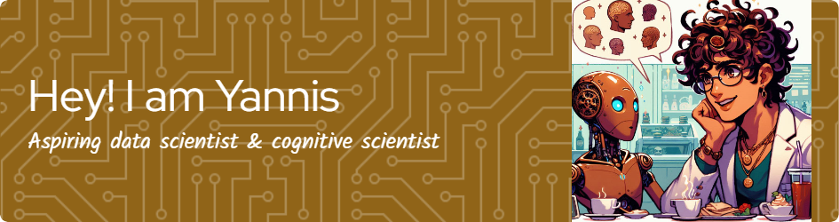
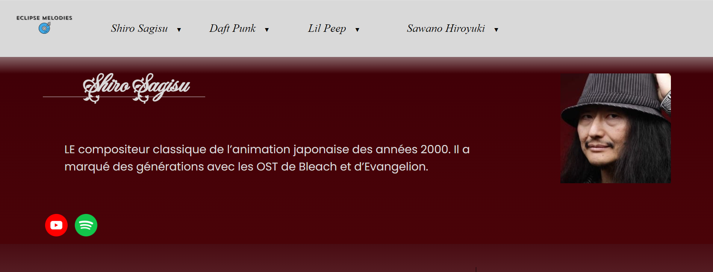
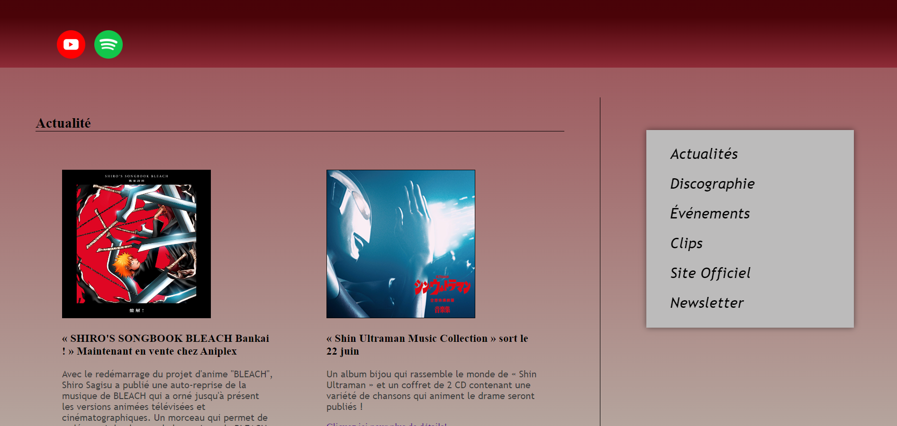

## Hi there 👋

 

  <a href="https://www.linkedin.com/in/yannis-messadia-2a316025a/">LinkedIn</a>

I'm a young aspiring data scientist with a background in cognitive science and neuroscience applied in human-machine interaction. 
I'm currently a student at La Plateforme, in France. I will be looking for an internship soon ! 😄

- 🔭 I’m currently working on building a strong foundation in Python and R. I'm also actively learning about mathematics applied to Data Science. Any feedback and guidance in more than welcome ! :)
- 🌱 I'm also learning about web developpement (HMTL, CSS)
- 👯 I'd love to connect with my seniors to open my mind about AI and programming in general ! I strongly value the experience of my predecessors and the inspiration I can get from them !

## 🛠️ Technologies and tools in learning

Python, R, Linux, HTML, CSS, Shell

## Statistiques

## 📁 My projects 

### Creating a basic fansite about Shiro Sagisu
I heard that programmation is all about learning by doing. So I tried to create a local fansite about a compositor i'm very enthousiast about : Shiro Sagisu, the man behind Bleach, Evangelion and Berserk's most memorable OSTs.

- I used **HTML and CSS**
- With the objective to **learn the basics about web programming** by creating a simple but functionnal website
- Functionalities : **responsive design**, **sticky navbars**, **contact forms**, **flexbox**

### Main takeaways
- I learnt on **how to structure** a website using HTML
- I learnt the **basics of stylisation** with CSS
- I had my first collaborative coding experience with Git for this project ! What works, **teamwork** !

### Screens

   

<!--
**yannis-messadia/yannis-messadia** is a ✨ _special_ ✨ repository because its `README.md` (this file) appears on your GitHub profile.

Here are some ideas to get you started:

- 🔭 I’m currently working on ...
- 🌱 I’m currently learning ...
- 👯 I’m looking to collaborate on ...
- 🤔 I’m looking for help with ...
- 💬 Ask me about ...
- 📫 How to reach me: ...
- 😄 Pronouns: ...
- ⚡ Fun fact: ...
-->
